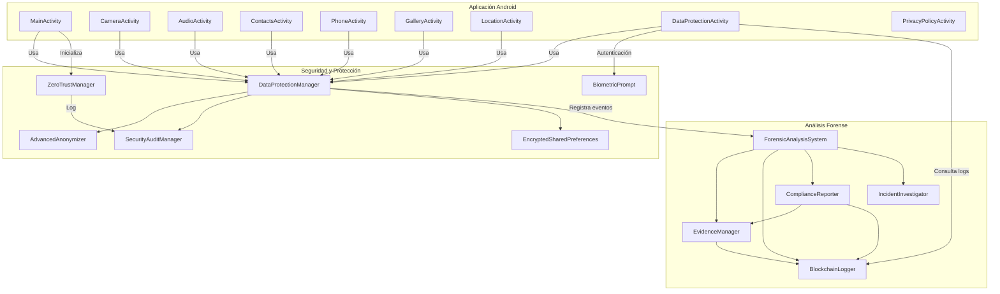

```mermaid
graph TD
  subgraph Aplicación Android
    A1[MainActivity]
    A2[CameraActivity]
    A3[AudioActivity]
    A4[ContactsActivity]
    A5[PhoneActivity]
    A6[GalleryActivity]
    A7[LocationActivity]
    A8[DataProtectionActivity]
    A9[PrivacyPolicyActivity]
  end

  subgraph Seguridad y Protección
    B1[DataProtectionManager]
    B2[AdvancedAnonymizer]
    B3[SecurityAuditManager]
    B4[EncryptedSharedPreferences]
    B5[BiometricPrompt]
    B6[ZeroTrustManager]
  end

  subgraph Análisis Forense
    C1[ForensicAnalysisSystem]
    C2[EvidenceManager]
    C3[BlockchainLogger]
    C4[ComplianceReporter]
    C5[IncidentInvestigator]
  end

  %% Relaciones entre componentes
  A1 -->|Usa| B1
  A2 -->|Usa| B1
  A3 -->|Usa| B1
  A4 -->|Usa| B1
  A5 -->|Usa| B1
  A6 -->|Usa| B1
  A7 -->|Usa| B1
  A8 -->|Usa| B1
  A8 -->|Autenticación| B5
  A1 -->|Inicializa| B6
  B1 --> B2
  B1 --> B3
  B1 --> B4
  B6 -->|Log| B3
  B1 -->|Registra eventos| C1
  C1 --> C2
  C1 --> C3
  C1 --> C4
  C1 --> C5
  C2 --> C3
  C4 --> C2
  C4 --> C3
  A8 -->|Consulta logs| C3

```