<p align="center"><a href="https://www.uns.edu.pe" target="_blank"></a></p>

<p align="center">
  <a href="https://developer.android.com/" target="_blank"></a>
  <a href="https://kotlinlang.org/" target="_blank"></a>
  <a href="https://developer.android.com/topic/security" target="_blank"></a>
  <a href="https://github.com/bumptech/glide" target="_blank"></a>
</p>

<p align="center">
  <a href="https://developer.android.com/training/sign-in/biometric-auth" target="_blank"></a>
  <a href="https://developer.android.com/training/data-storage/room" target="_blank"></a>
  <a href="https://www.sqlite.org/" target="_blank"></a>
</p>

# App de Seguridad y Privacidad

Una aplicación Android que demuestra el manejo seguro de permisos y protección de datos personales.

## 📁 Recursos

### 🔗 Documentos importantes

- [**Resolución de la consigna**](https://github.com/josevasquezramos/seguridad_priv_a/blob/master/RESOLUCION.md)

### 📚 Entregables

1. [**Código fuente**](https://github.com/josevasquezramos/seguridad_priv_a/) de todas las implementaciones solicitadas
2. [**Informe técnico**](https://github.com/josevasquezramos/seguridad_priv_a/blob/master/informe_tecnico.pdf) detallando vulnerabilidades encontradas y soluciones aplicadas
3. [**Diagramas de arquitectura**](https://github.com/josevasquezramos/seguridad_priv_a/blob/master/ARQUITECTURA.md) para componentes de seguridad nuevos
4. [**Suite de pruebas**](https://github.com/josevasquezramos/seguridad_priv_a/tree/master/app/src/androidTest/java/com/example/seguridad_priv_a) automatizadas para validar medidas de seguridad
5. [**Manual de deployment**](https://github.com/josevasquezramos/seguridad_priv_a/blob/master/manual_deployment.pdf) con consideraciones de seguridad para producción

## 📷 Capturas

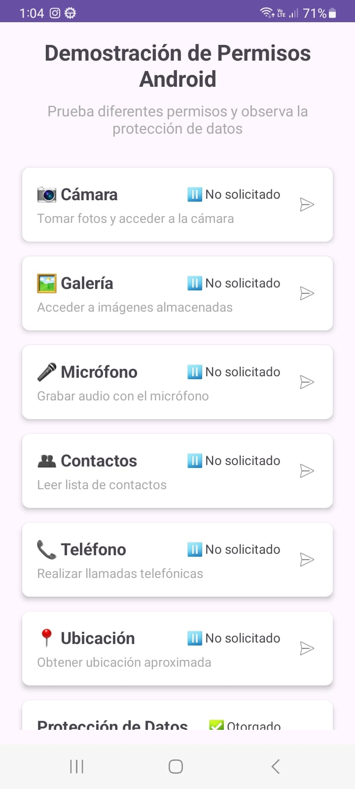
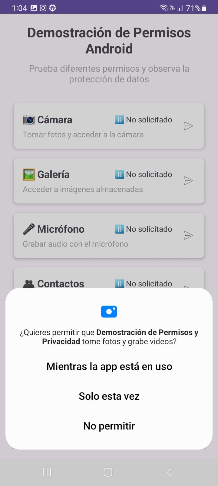
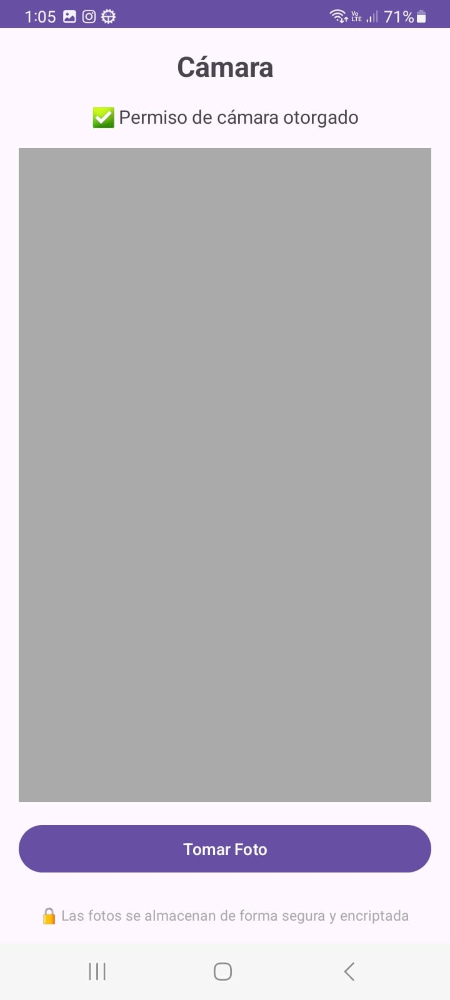
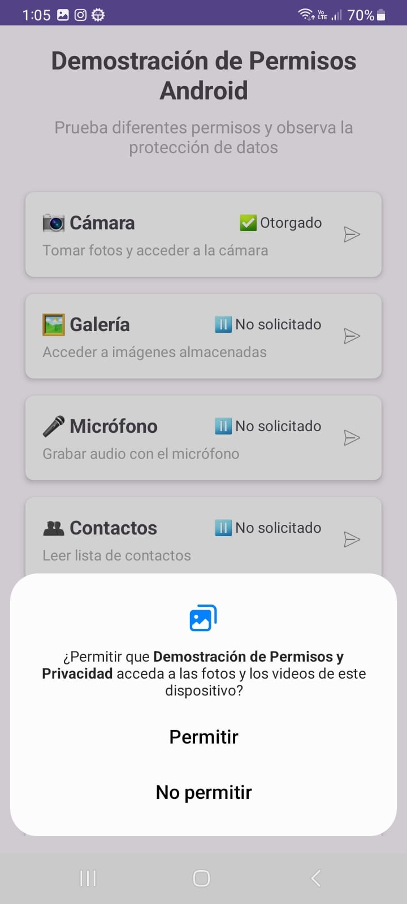
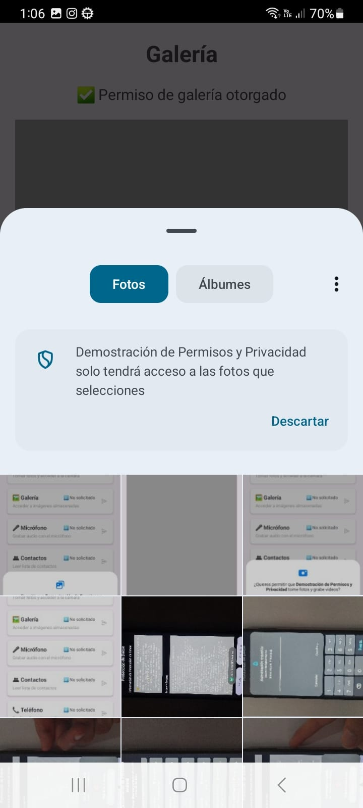
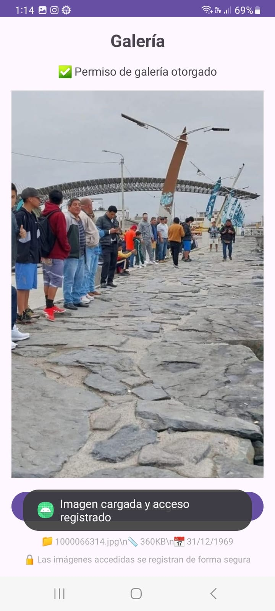
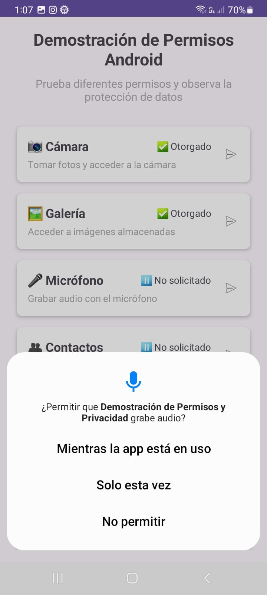
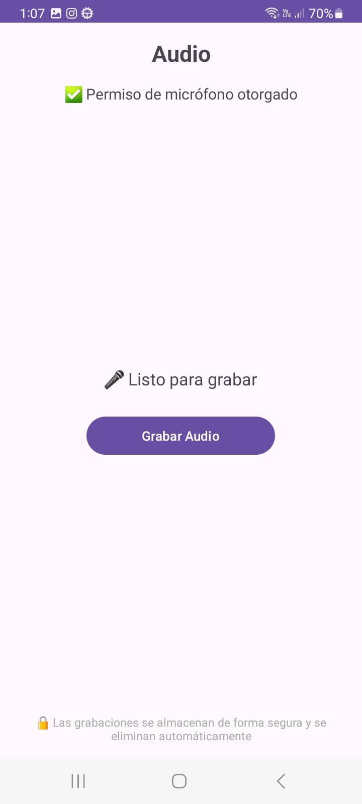
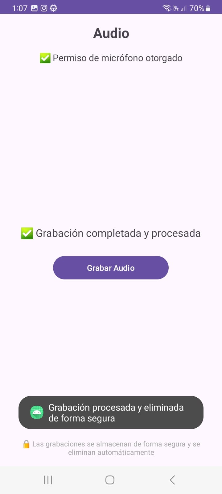
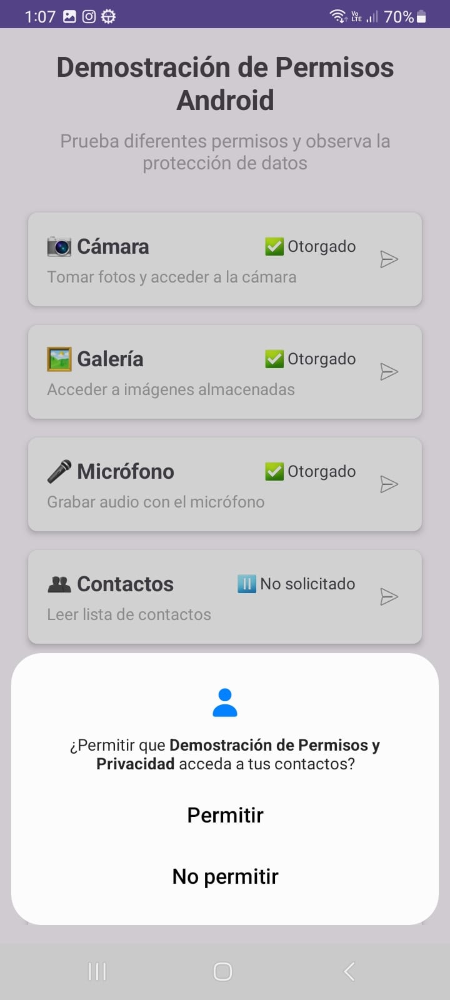
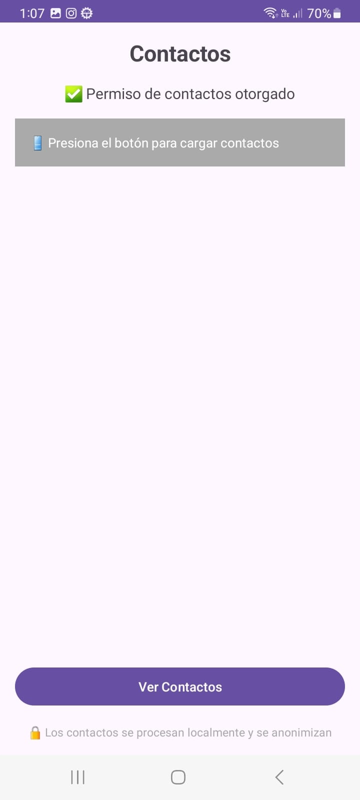
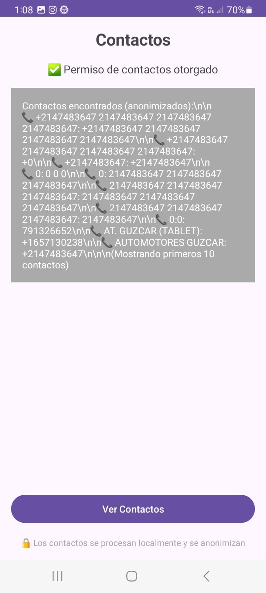
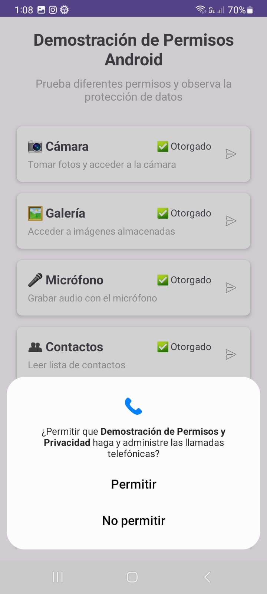
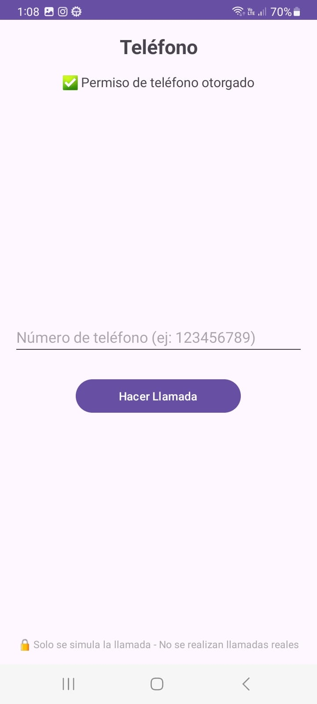
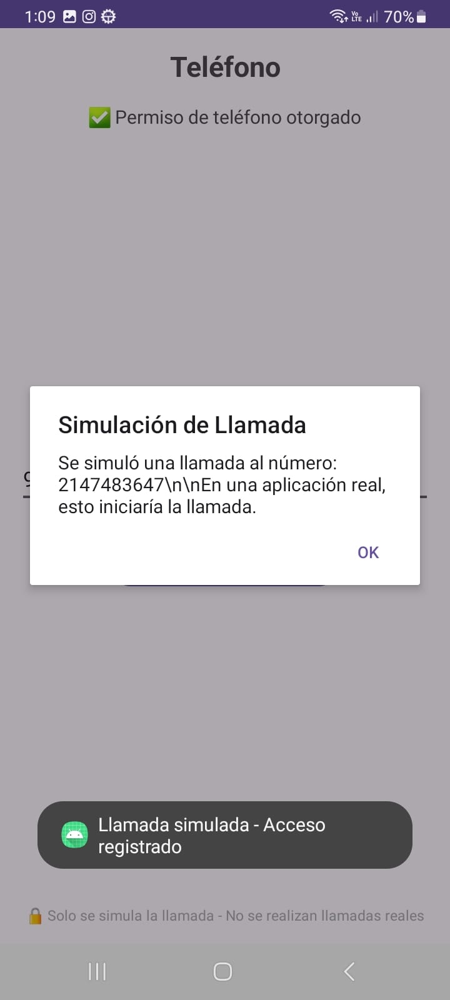
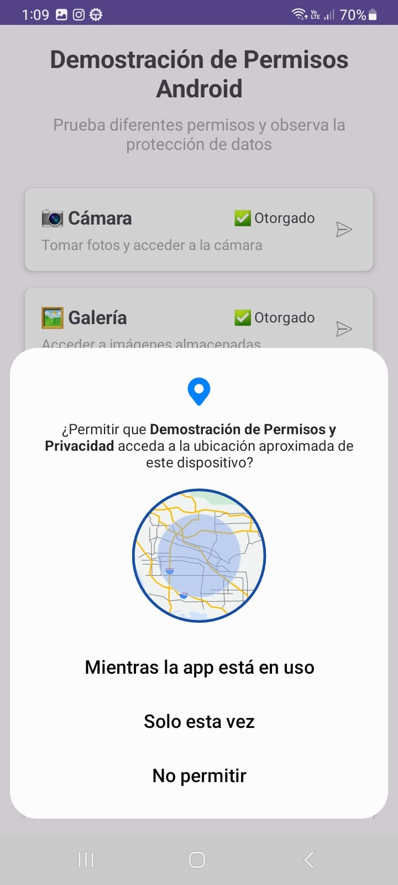
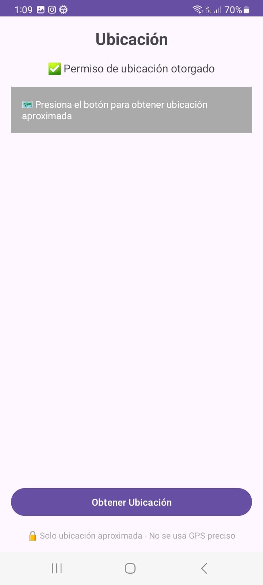


## Características

### Gestión de Permisos
- **Cámara**: Captura de fotos con manejo seguro
- **Galería**: Acceso a imágenes del dispositivo
- **Micrófono**: Grabación de audio con permisos dinámicos
- **Contactos**: Lectura segura de la lista de contactos
- **Teléfono**: Funcionalidad de llamadas
- **Ubicación**: Acceso a localización del usuario

### Seguridad y Privacidad
- **Protección de Datos**: Sistema de logging encriptado
- **Almacenamiento Seguro**: Base de datos SQLCipher
- **Permisos Runtime**: Solicitud dinámica de permisos
- **Política de Privacidad**: Información transparente sobre el uso de datos

## Tecnologías Utilizadas

- **Kotlin**: Lenguaje principal
- **Android Jetpack**: Componentes modernos
- **SQLCipher**: Encriptación de base de datos
- **Camera2 API**: Manejo avanzado de cámara
- **Security Crypto**: Encriptación de datos sensibles

## Instalación

1. Clona el repositorio
2. Abre el proyecto en Android Studio
3. Sincroniza las dependencias
4. Ejecuta en dispositivo o emulador

## Estructura del Proyecto

```
📁 app/
├── 📁 src/main/java/com/example/seguridad_priv_a/
│   ├── 📁 adapter/
│   │   └── 📄 PermissionsAdapter.kt       # Adaptador RecyclerView
│   ├── 📁 data/
│   │   ├── 📄 DataProtectionManager.kt    # Gestión de datos seguros
│   │   └── 📄 PermissionItem.kt           # Modelo de permisos
│   ├── 📁 forense/
│   │   └── 📄 ForensicAnalysisSystem.kt   # Análisis Forense y Compliance
│   ├── 📁 security/
│   │   ├── 📄 AdvancedAnonymizer.kt       # Anonimización avanzada de datos
│   │   ├── 📄 AntiTampering.kt            # Detección de manipulación de la app
│   │   ├── 📄 AppSignatureVerifier.kt     # Verificación de firma de la app
│   │   ├── 📄 CertificatePinnerHelper.kt  # Pinning de certificados SSL
│   │   ├── 📄 SecurityAuditManager.kt     # Gestión de auditorías de seguridad
│   │   ├── 📄 StringObfuscator.kt         # Ofuscación de cadenas
│   │   └── 📄 ZeroTrustManager.kt         # Implementación de Zero Trust
│   ├── 📄 MainActivity.kt                 # Pantalla principal
│   ├── 📄 PermissionsApplication.kt       # Configuración global
│   └── 📄 [Actividades individuales]
└── 📁 res/
    ├── 📁 layout/                         # Diseños XML
    ├── 📁 values/                         # Recursos y strings
    └── 📁 xml/                            # Configuraciones
```

## Permisos Requeridos

- `CAMERA` - Para captura de fotos
- `READ_MEDIA_IMAGES` - Acceso a galería
- `RECORD_AUDIO` - Grabación de audio
- `READ_CONTACTS` - Lectura de contactos
- `CALL_PHONE` - Realizar llamadas
- `ACCESS_COARSE_LOCATION` - Ubicación aproximada

## Licencia

Este proyecto es para fines educativos y demostrativos.
