# Evaluación Técnica: Análisis y Mejora de Seguridad en Aplicación Android

**Alumno:** [Jose Manuel Vasquez Ramos](https://github.com/josevasquezramos)    
**Código:** [0202114010](mailto:202114010@uns.edu.pe)    

**Docente:** [Johan Max Alexander López Heredia](https://github.com/GxJohan)    
**Asignatura:** Aplicaciones Móviles    

## Introducción

Esta evaluación técnica se basa en una aplicación Android que implementa un sistema de demostración de permisos y protección de datos. La aplicación utiliza tecnologías modernas como Kotlin, Android Security Crypto, SQLCipher y patrones de arquitectura MVVM.

## Parte 1: Análisis de Seguridad Básico (0-7 puntos)

### 1.1 Identificación de Vulnerabilidades (2 puntos)

Analiza el archivo [`DataProtectionManager.kt`](https://github.com/josevasquezramos/seguridad_priv_a/blob/master/app/src/main/java/com/example/seguridad_priv_a/data/DataProtectionManager.kt) y responde:

#### 1.1.1 ¿Qué método de encriptación se utiliza para proteger datos sensibles?

El método de encriptación utilizado para proteger datos sensibles es AES-256-GCM (Advanced Encryption Standard con un tamaño de clave de 256 bits en modo Galois/Counter Mode). Esto se implementa mediante la clase `EncryptedSharedPreferences` de la librería Android Security Crypto, que utiliza:
- **PrefKeyEncryptionScheme.AES256_SIV** para encriptar las claves.
- **PrefValueEncryptionScheme.AES256_GCM** para encriptar los valores.

#### 1.1.2 Identifica al menos 2 posibles vulnerabilidades en la implementación actual del logging

- **Vulnerabilidad 1: Almacenamiento de logs en SharedPreferences sin encriptar.**
    Los logs de acceso se guardan en `SharedPreferences` sin encriptar (`accessLogPrefs`), lo que podría exponer información sensible (como timestamps, acciones realizadas, etc.) si el dispositivo es comprometido.
    - **Riesgo:** Un atacante con acceso físico al dispositivo podría leer los logs para entender patrones de uso o identificar datos sensibles.

- **Vulnerabilidad 2: Falta de sanitización en los logs.**
    Los logs registran directamente mensajes como `"Error al procesar imagen: ${e.message}"` o `"Llamada simulada a número anonimizado: $anonymizedNumber"`. Si `e.message` o `anonymizedNumber` contienen caracteres maliciosos o secuencias de escape, podrían explotarse para ataques de inyección (por ejemplo si los logs se visualizan en un sistema vulnerable).
    - **Solución:** Aplicar sanitización (ej. eliminar saltos de línea o caracteres especiales) antes de guardar los logs.

#### 1.1.3 ¿Qué sucede si falla la inicialización del sistema de encriptación?

- **Fallback a SharedPreferences no encriptados:**
    En el bloque `catch (e: Exception)`, se inicializa `encryptedPrefs` como un `SharedPreferences` normal (`Context.MODE_PRIVATE`). Esto significa que los datos sensibles se guardarán sin encriptación, lo que reduce la seguridad.

- **Riesgo:**
    Si la encriptación falla (ej. por problemas con `MasterKey`), los datos quedarán almacenados en claro, vulnerables a extracción en dispositivos rooted o mediante ataques de acceso físico.

- **Mejora posible:**
    - Notificar al usuario y deshabilitar funcionalidades sensibles.
    - Usar un mecanismo de fallback alternativo (por ejemplo SQLCipher) en lugar de SharedPreferences no encriptados.

### 1.2 Permisos y Manifiesto (2 puntos)

Examina [`AndroidManifest.xml`](https://github.com/josevasquezramos/seguridad_priv_a/blob/master/app/src/main/AndroidManifest.xml) y [`MainActivity.kt`](https://github.com/josevasquezramos/seguridad_priv_a/blob/master/app/src/main/java/com/example/seguridad_priv_a/MainActivity.kt):

#### 1.2.1 Lista todos los permisos peligrosos declarados en el manifiesto

Los permisos peligrosos (*dangerous permissions*) declarados en [`AndroidManifest.xml`](https://github.com/josevasquezramos/seguridad_priv_a/blob/master/app/src/main/AndroidManifest.xml) son:

1. `android.permission.CAMERA`
2. `android.permission.READ_EXTERNAL_STORAGE` (obsoleto en Android 11+, reemplazado por `READ_MEDIA_IMAGES`)
3. `android.permission.READ_MEDIA_IMAGES` (requerido en Android 13+)
4. `android.permission.RECORD_AUDIO`
5. `android.permission.READ_CONTACTS`
6. `android.permission.CALL_PHONE`
7. `android.permission.SEND_SMS`
8. `android.permission.ACCESS_COARSE_LOCATION`

Nota:

- `ACCESS_NETWORK_STATE` no es un permiso peligroso (es de tipo normal).
- `READ_EXTERNAL_STORAGE` está obsoleto en versiones recientes de Android, pero aún puede aparecer para compatibilidad.

#### 1.2.2 ¿Qué patrón se utiliza para solicitar permisos en runtime?

El patrón utilizado es el **sistema de permisos en tiempo de ejecución (runtime permissions)** introducido en Android 6.0 (API 23), implementado mediante:

- **`ActivityResultContracts.RequestPermission()`**:
    - Se registra un `launcher` (`requestPermissionLauncher`) para manejar la respuesta del usuario.
    - En [`MainActivity.kt`](https://github.com/josevasquezramos/seguridad_priv_a/blob/master/app/src/main/java/com/example/seguridad_priv_a/MainActivity.kt), se usa:

    ```kotlin
    private val requestPermissionLauncher = registerForActivityResult(
        ActivityResultContracts.RequestPermission()
    ) { isGranted ->
        // Lógica para actualizar el estado del permiso
    }
    ```

- **Flujo de solicitud:**
    - Se verifica el permiso con `ContextCompat.checkSelfPermission()`.
    - Si no está concedido, se solicita con `requestPermissionLauncher.launch(perm)`.
    - Si el usuario deniega el permiso, se puede mostrar una explicación con `shouldShowRequestPermissionRationale()`.

    ```kotlin
    private fun handlePermissionClick(permission: PermissionItem) {
        when {
            permission.status == PermissionStatus.NOT_REQUESTED -> requestPermission(permission)
            permission.status == PermissionStatus.DENIED -> openActivity(permission) // Manejar denegación
        }
    }
    ```

#### 1.2.3 Identifica qué configuración de seguridad previene backups automáticos

La prevención de backups automáticos se configura en el [`AndroidManifest.xml`](https://github.com/josevasquezramos/seguridad_priv_a/blob/master/app/src/main/AndroidManifest.xml) con:

1. `android:allowBackup="false"`:
    - Desactiva el backup automático de la app en Google Drive.
    - Evita que datos sensibles se incluyan en backups no controlados.

2. `android:fullBackupContent="@xml/backup_rules"`:
    Si `allowBackup="true"`, este atributo permite definir reglas personalizadas para excluir datos sensibles (pero en este caso está desactivado).

**Justificación:**

- Sin `allowBackup="false"`, un atacante con acceso físico al dispositivo podría restaurar datos de la app desde un backup.
- La combinación con `dataExtractionRules` (en Android 12+) refuerza la protección contra extracción de datos por apps de backup no autorizadas.

### 1.3 Gestión de Archivos (3 puntos)

Revisa [`CameraActivity.kt`](https://github.com/josevasquezramos/seguridad_priv_a/blob/master/app/src/main/java/com/example/seguridad_priv_a/CameraActivity.kt) y [`file_paths.xml`](https://github.com/josevasquezramos/seguridad_priv_a/blob/master/app/src/main/res/xml/file_paths.xml):

#### 1.3.1 ¿Cómo se implementa la compartición segura de archivos de imágenes?

La compartición segura se implementa mediante `FileProvider`, un componente de Android que permite compartir archivos entre apps de forma controlada y sin exponer rutas directas (`file://`). Los pasos clave son:

1. Definición del `FileProvider` en [`AndroidManifest.xml`](https://github.com/josevasquezramos/seguridad_priv_a/blob/master/app/src/main/AndroidManifest.xml):

    ```xml
    <provider
        android:name="androidx.core.content.FileProvider"
        android:authorities="com.example.seguridad_priv_a.fileprovider"
        android:exported="false"
        android:grantUriPermissions="true">
        <meta-data
            android:name="android.support.FILE_PROVIDER_PATHS"
            android:resource="@xml/file_paths" />
    </provider>
    ```

    - `exported="false"`: Evita que otras apps accedan directamente al provider.
    - `grantUriPermissions="true"`: Permite otorgar permisos temporales a URIs específicos.

2. Configuración de rutas permitidas en [`file_paths.xml`](https://github.com/josevasquezramos/seguridad_priv_a/blob/master/app/src/main/res/xml/file_paths.xml):

    ```xml
    <paths>
        <external-files-path name="my_images" path="Pictures" />
    </paths>
    ```

    - Limita el acceso solo al directorio `Pictures` dentro del almacenamiento externo privado de la app (`Context.getExternalFilesDir()`).

3. Generación de URI segura en [`CameraActivity.kt`](https://github.com/josevasquezramos/seguridad_priv_a/blob/master/app/src/main/java/com/example/seguridad_priv_a/CameraActivity.kt):

    ```kotlin
    currentPhotoUri = FileProvider.getUriForFile(
        this,
        "com.example.seguridad_priv_a.fileprovider",
        photoFile
    )
    ```

    - Convierte la ruta del archivo (`photoFile`) en una URI segura (`content://`).

4. Uso de la URI con `ActivityResultContracts.TakePicture()`:

    ```kotlin
    takePictureLauncher.launch(currentPhotoUri)
    ```

    - La cámara recibe la URI con permisos temporales para escribir en el archivo.

#### 1.3.2 ¿Qué autoridad se utiliza para el `FileProvider`?

La autoridad (*authority*) definida es:

```xml
android:authorities="com.example.seguridad_priv_a.fileprovider"
```

Esta cadena **debe ser única** en el dispositivo y generalmente sigue el formato:

```xml
<package-name>.fileprovider
```

- **Uso en código:** Se referencia la misma autoridad al llamar a `FileProvider.getUriForFile()`.

#### 1.3.3 Explica por qué no se debe usar `file://` URIs directamente

Usar URIs con esquema `file://` presenta riesgos de seguridad:

1. Exposición de rutas del sistema de archivos

    Cualquier app con permisos de almacenamiento podría:

    - Acceder a los archivos.
    - Modificar o eliminar los archivos.
    - Ver rutas sensibles del sistema de archivos.

2. Violación de la política de seguridad de Android (`StrictMode`)

    Desde **Android 7.0 (API 24)**:

    - Las URIs `file://` están bloqueadas para compartir entre apps.
    - Usarlas lanza una excepción: `FileUriExposedException`.

3. Falta de control de permisos

    - Con `FileProvider`, se otorgan **permisos temporales** solo a apps específicas (por ejemplo, la cámara).
    - Con `file://`, **no hay restricciones**: cualquier app con permisos generales podría acceder.

4. Incompatibilidad con scoped storage

    - A partir de **Android 10+ (API 29)**, el acceso directo a rutas externas está restringido.
    - `FileProvider` se adapta automáticamente a estas restricciones.

**Ejemplo de vulnerabilidad:**
Si una app guarda una foto en `file:///storage/emulated/0/Android/data/com.example.app/Pictures/photo.jpg` y comparte la ruta, otra app maliciosa podría leerla sin permiso.

## Parte 2: Implementación y Mejoras Intermedias (8-14 puntos)

### 2.1 Fortalecimiento de la Encriptación (3 puntos)

Modifica `DataProtectionManager.kt` para implementar:

- Rotación automática de claves maestras cada 30 días
- Verificación de integridad de datos encriptados usando HMAC
- Implementación de key derivation con salt único por usuario

```kotlin
// Ejemplo de estructura esperada
fun rotateEncryptionKey(): Boolean {
    // Tu implementación aquí
}

fun verifyDataIntegrity(key: String): Boolean {
    // Tu implementación aquí
}
```

#### Resolución

**Código implementado:** [`DataProtectionManager.kt`](https://github.com/josevasquezramos/seguridad_priv_a/blob/master/app/src/main/java/com/example/seguridad_priv_a/data/DataProtectionManager.kt)

**Prueba instrumental:** [`DataProtectionManagerTest.kt`](https://github.com/josevasquezramos/seguridad_priv_a/blob/master/app/src/androidTest/java/com/example/seguridad_priv_a/data/DataProtectionManagerTest.kt)

**Resultados de Prueba instrumental:**

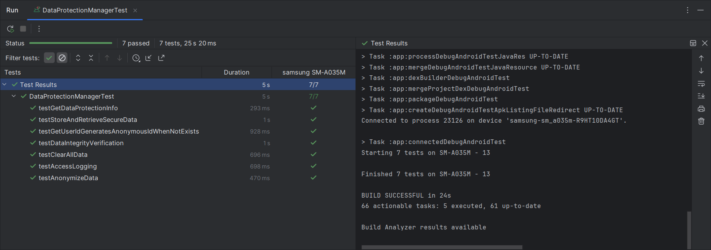

### 2.2 Sistema de Auditoría Avanzado (3 puntos)

Crea una nueva clase [`SecurityAuditManager`](https://github.com/josevasquezramos/seguridad_priv_a/blob/master/app/src/main/java/com/example/seguridad_priv_a/security/SecurityAuditManager.kt) que:

- Detecte intentos de acceso sospechosos (múltiples solicitudes en corto tiempo)
- Implemente rate limiting para operaciones sensibles
- Genere alertas cuando se detecten patrones anómalos
- Exporte logs en formato JSON firmado digitalmente

#### Resolución

**Código implementado:** [`SecurityAuditManager.kt`](https://github.com/josevasquezramos/seguridad_priv_a/blob/master/app/src/main/java/com/example/seguridad_priv_a/security/SecurityAuditManager.kt)

**Prueba instrumental:** [`SecurityAuditManagerInstrumentedTest.kt`](https://github.com/josevasquezramos/seguridad_priv_a/blob/master/app/src/androidTest/java/com/example/seguridad_priv_a/security/SecurityAuditManagerInstrumentedTest.kt)

**Resultados de Prueba instrumental:**

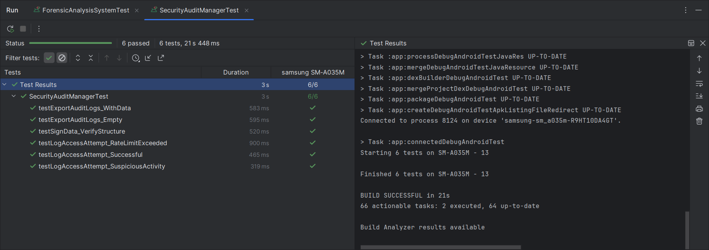

### 2.3 Biometría y Autenticación (3 puntos)

Implementa autenticación biométrica en [`DataProtectionActivity.kt`](https://github.com/josevasquezramos/seguridad_priv_a/blob/master/app/src/main/java/com/example/seguridad_priv_a/DataProtectionActivity.kt):

- Integra BiometricPrompt API para proteger el acceso a logs
- Implementa fallback a PIN/Pattern si biometría no está disponible
- Añade timeout de sesión tras inactividad de 5 minutos

#### Resolución

**Código implementado:** [`DataProtectionActivity.kt`](https://github.com/josevasquezramos/seguridad_priv_a/blob/master/app/src/main/java/com/example/seguridad_priv_a/DataProtectionActivity.kt)

**Resultados:**

Celular Android con desbloqueo biométrico por huella digital y PIN de seguridad como respaldo.

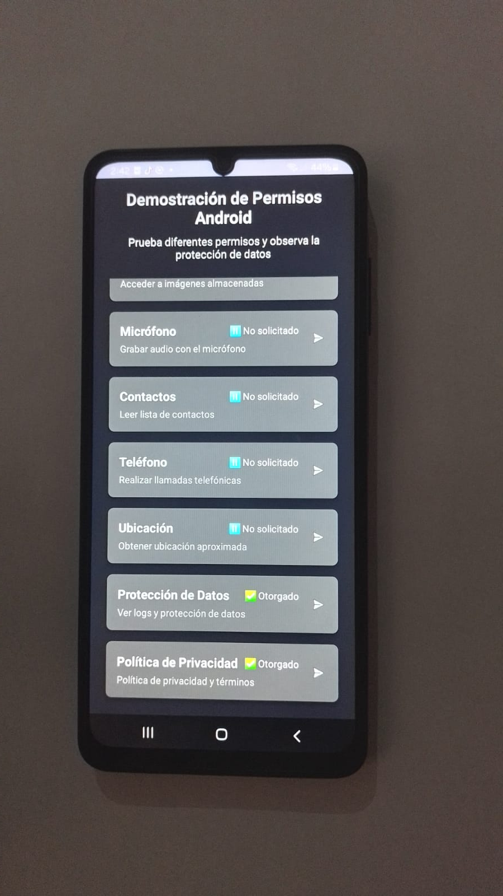
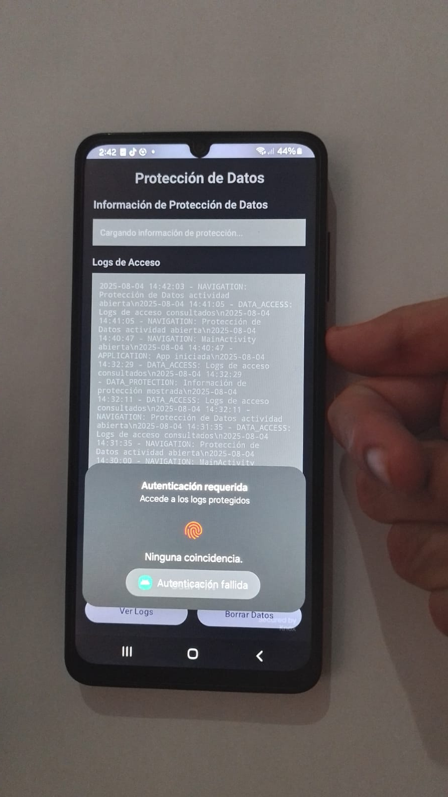
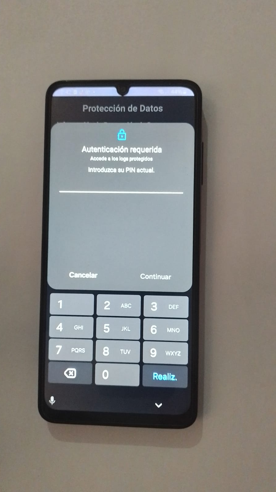
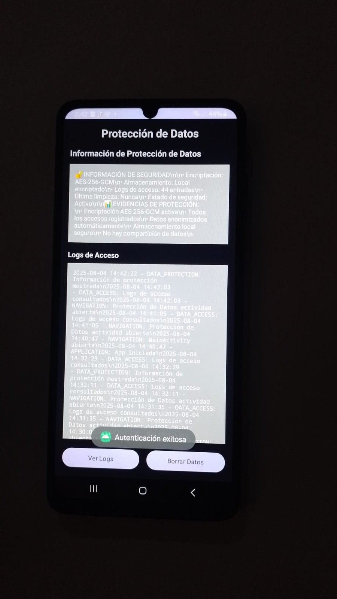

Celular Android con desbloqueo mediante patrón de seguridad.

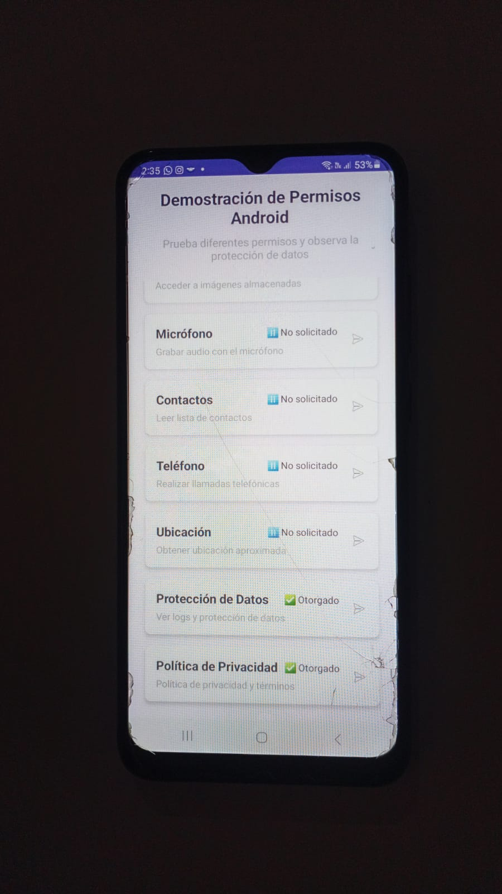
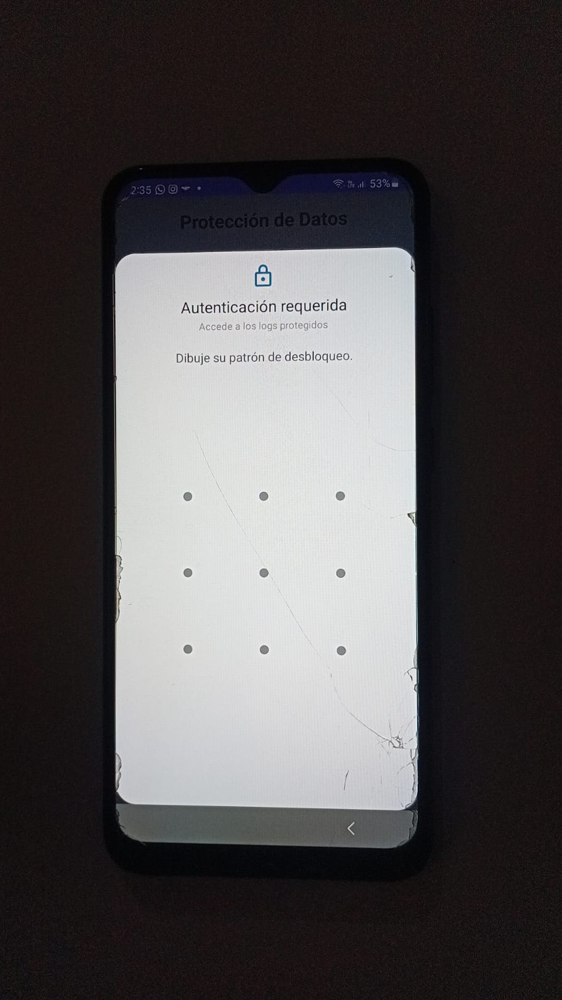
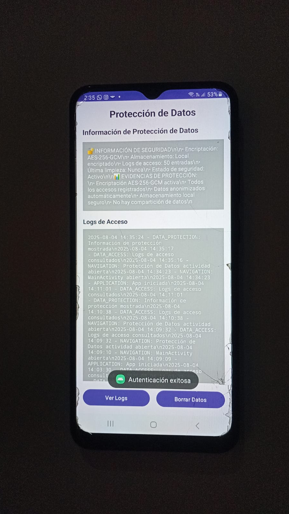
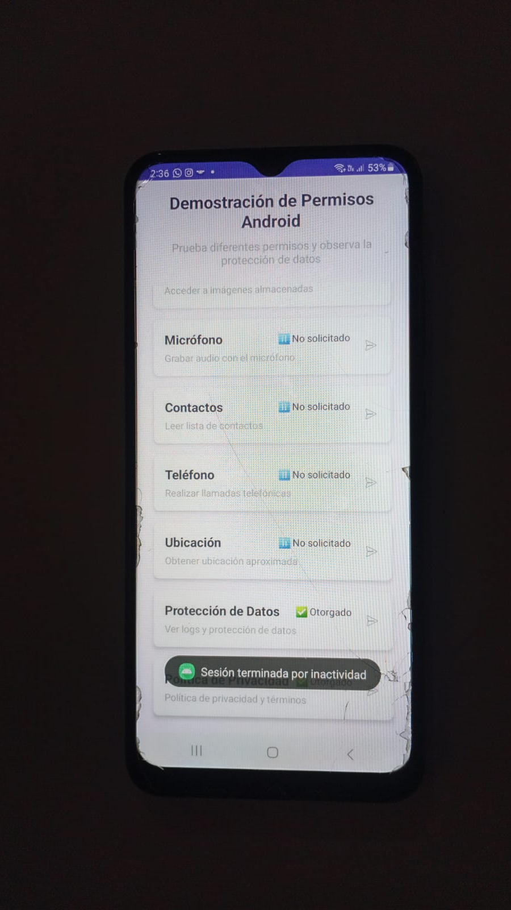

## Parte 3: Arquitectura de Seguridad Avanzada (15-20 puntos)

### 3.1 Implementación de Zero-Trust Architecture (3 puntos)

Diseña e implementa un sistema que:

- Valide cada operación sensible independientemente
- Implemente principio de menor privilegio por contexto
- Mantenga sesiones de seguridad con tokens temporales
- Incluya attestation de integridad de la aplicación

#### Resolución

**Código implementado:** [`ZeroTrustManager.kt`](https://github.com/josevasquezramos/seguridad_priv_a/blob/master/app/src/main/java/com/example/seguridad_priv_a/security/ZeroTrustManager.kt)

**Prueba instrumental:** [`ZeroTrustManagerTest.kt`](https://github.com/josevasquezramos/seguridad_priv_a/blob/master/app/src/androidTest/java/com/example/seguridad_priv_a/security/ZeroTrustManagerTest.kt)

**Resultados de Prueba instrumental:**

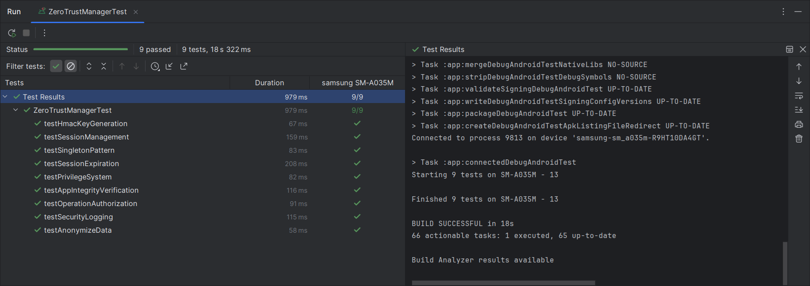

### 3.2 Protección Contra Ingeniería Inversa (3 puntos)

Implementa medidas anti-tampering:

- Detección de debugging activo y emuladores
- Obfuscación de strings sensibles y constantes criptográficas
- Verificación de firma digital de la aplicación en runtime
- Implementación de certificate pinning para comunicaciones futuras

#### Resolución

**Código implementado:**
- [`AntiTampering.kt`](https://github.com/josevasquezramos/seguridad_priv_a/blob/master/app/src/main/java/com/example/seguridad_priv_a/security/AntiTampering.kt)
- [`StringObfuscator.kt`](https://github.com/josevasquezramos/seguridad_priv_a/blob/master/app/src/main/java/com/example/seguridad_priv_a/security/StringObfuscator.kt)
- [`AppSignatureVerifier.kt`](https://github.com/josevasquezramos/seguridad_priv_a/blob/master/app/src/main/java/com/example/seguridad_priv_a/security/AppSignatureVerifier.kt)
- [`CertificatePinnerHelper.kt`](https://github.com/josevasquezramos/seguridad_priv_a/blob/master/app/src/main/java/com/example/seguridad_priv_a/security/CertificatePinnerHelper.kt)

**Prueba instrumental:** [`SecurityComponentsTest.kt`](https://github.com/josevasquezramos/seguridad_priv_a/blob/master/app/src/androidTest/java/com/example/seguridad_priv_a/security/SecurityComponentsTest.kt)

**Resultados de Prueba instrumental:**

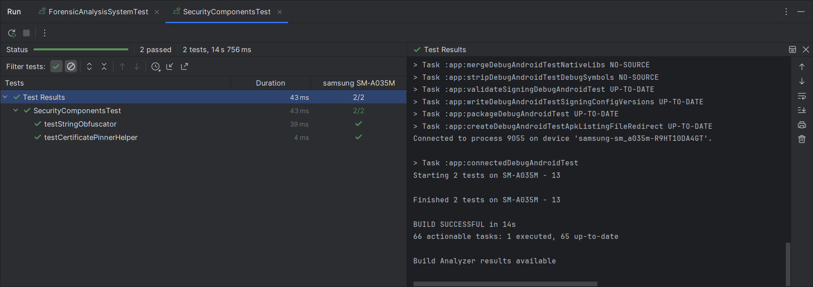

### 3.3 Framework de Anonimización Avanzado (2 puntos)

Mejora el método `anonymizeData()` actual implementando:

- Algoritmos de k-anonimity y l-diversity
- Differential privacy para datos numéricos
- Técnicas de data masking específicas por tipo de dato
- Sistema de políticas de retención configurables

```kotlin
class AdvancedAnonymizer {
    fun anonymizeWithKAnonymity(data: List<PersonalData>, k: Int): List<AnonymizedData>
    fun applyDifferentialPrivacy(data: NumericData, epsilon: Double): NumericData
    fun maskByDataType(data: Any, maskingPolicy: MaskingPolicy): Any
}
```

#### Resolución

**Código implementado:** [`AdvancedAnonymizer.kt`](https://github.com/josevasquezramos/seguridad_priv_a/blob/master/app/src/main/java/com/example/seguridad_priv_a/security/AdvancedAnonymizer.kt)

### 3.4 Análisis Forense y Compliance (2 puntos)

Desarrolla un sistema de análisis forense que:

- Mantenga chain of custody para evidencias digitales
- Implemente logs tamper-evident usando blockchain local
- Genere reportes de compliance GDPR/CCPA automáticos
- Incluya herramientas de investigación de incidentes

#### Resolución

**Código implementado:** [`ForensicAnalysisSystem.kt`](https://github.com/josevasquezramos/seguridad_priv_a/blob/master/app/src/main/java/com/example/seguridad_priv_a/forense/ForensicAnalysisSystem.kt)

**Prueba instrumental:** [`ForensicAnalysisSystemTest.kt`](https://github.com/josevasquezramos/seguridad_priv_a/blob/master/app/src/androidTest/java/com/example/seguridad_priv_a/forense/ForensicAnalysisSystemTest.kt)

**Resultados de Prueba instrumental:**

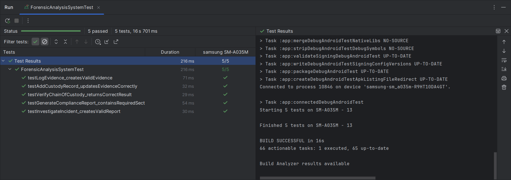
